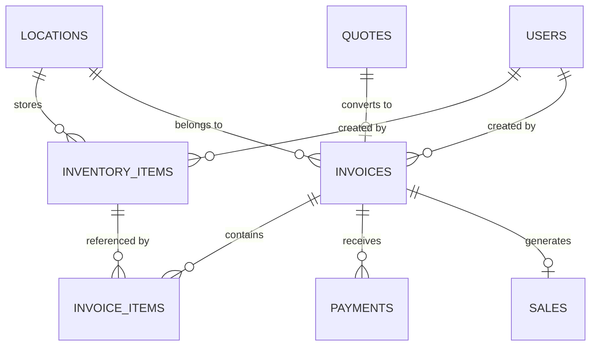

# Invoice & Inventory System Database Schema

This document provides a comprehensive overview of the database structure for the EV Wheels Invoice and Inventory management system.

## Table of Contents
- [Overview](#overview)
- [Core Entities](#core-entities)
- [Database Tables](#database-tables)
- [Table Relationships](#table-relationships)
- [Data Flow](#data-flow)
- [Integration Points](#integration-points)

## Overview

The system manages two main business processes:
1. **Inventory Management** - Products and services with stock tracking
2. **Invoice Management** - Quotes, invoices, payments with inventory integration

## Core Entities

### Item Types
- **Products**: Physical items (batteries, chargers, controllers, motors, parts)
- **Services**: Labor services (diagnostics, repairs, maintenance, installation)

### Business Flow
1. Inventory items are created (products/services)
2. Items are used in quotes/invoices
3. Invoices are paid, creating sales records
4. Sales records use inventory categories for analytics

## Database Tables

### Inventory Tables

#### `inventory_items`
Main inventory table storing all products and services.

| Column | Type | Description | Constraints |
|--------|------|-------------|-------------|
| `id` | UUID | Primary key | PRIMARY KEY, DEFAULT gen_random_uuid() |
| `sku` | VARCHAR(100) | Stock Keeping Unit | UNIQUE, NOT NULL |
| `name` | VARCHAR(255) | Item name | NOT NULL |
| `description` | TEXT | Item description | NULLABLE |
| `item_type` | item_type | Product or service | NOT NULL, ENUM('product', 'service') |
| `category` | VARCHAR(100) | Item category | NULLABLE |
| `subcategory` | VARCHAR(100) | Item subcategory | NULLABLE |
| `item_condition` | item_condition | Item condition | DEFAULT 'new' |
| `unit_of_measure` | VARCHAR(50) | Unit of measure | DEFAULT 'each' |
| `weight_kg` | DECIMAL(8,3) | Weight in kg | NULLABLE |
| `dimensions` | JSONB | Dimensions object | NULLABLE |
| `cost_price` | DECIMAL(10,2) | Cost price | NULLABLE |
| `sale_price` | DECIMAL(10,2) | Sale price | NULLABLE |
| `service_price` | DECIMAL(10,2) | Service bundled price | NULLABLE |
| `current_stock` | INTEGER | Current stock level | DEFAULT 0 |
| `reserved_stock` | INTEGER | Reserved stock | DEFAULT 0 |
| `min_stock_level` | INTEGER | Minimum stock level | DEFAULT 0 |
| `max_stock_level` | INTEGER | Maximum stock level | NULLABLE |
| `reorder_point` | INTEGER | Reorder point | DEFAULT 0 |
| `estimated_duration_minutes` | INTEGER | Service duration | NULLABLE |
| `requires_technician` | BOOLEAN | Requires technician | DEFAULT false |
| `service_category` | VARCHAR(100) | Service category | NULLABLE |
| `is_sellable` | BOOLEAN | Can be sold | DEFAULT true |
| `is_purchasable` | BOOLEAN | Can be purchased | DEFAULT true |
| `track_serial_numbers` | BOOLEAN | Track serial numbers | DEFAULT false |
| `status` | VARCHAR(20) | Item status | DEFAULT 'active' |
| `location_id` | UUID | Location reference | FK to locations(id) |
| `supplier_info` | JSONB | Supplier information | NULLABLE |
| `created_at` | TIMESTAMPTZ | Creation timestamp | DEFAULT NOW() |
| `updated_at` | TIMESTAMPTZ | Update timestamp | DEFAULT NOW() |
| `created_by` | UUID | Creator user | FK to auth.users(id) |
| `updated_by` | UUID | Last updater | FK to auth.users(id) |

#### `stock_levels`
Tracks stock by location and condition.

| Column | Type | Description | Constraints |
|--------|------|-------------|-------------|
| `id` | UUID | Primary key | PRIMARY KEY |
| `item_id` | UUID | Inventory item | FK to inventory_items(id) |
| `location_id` | UUID | Location | FK to locations(id) |
| `condition` | item_condition | Item condition | NOT NULL |
| `quantity` | INTEGER | Available quantity | DEFAULT 0 |
| `reserved_quantity` | INTEGER | Reserved quantity | DEFAULT 0 |
| `last_counted_at` | TIMESTAMPTZ | Last count date | NULLABLE |
| `last_counted_by` | UUID | Last counter | FK to auth.users(id) |

### Invoice Tables

#### `invoices`
Main invoices table.

| Column | Type | Description | Constraints |
|--------|------|-------------|-------------|
| `id` | UUID | Primary key | PRIMARY KEY, DEFAULT gen_random_uuid() |
| `number` | TEXT | Invoice number | UNIQUE, NOT NULL |
| `status` | invoice_status | Invoice status | DEFAULT 'draft' |
| `customer` | JSONB | Customer information | NOT NULL |
| `totals` | JSONB | Calculated totals | NOT NULL |
| `currency` | TEXT | Currency code | DEFAULT 'INR' |
| `balance_due` | DECIMAL(10,2) | Balance due | DEFAULT 0 |
| `due_date` | TIMESTAMPTZ | Payment due date | NOT NULL |
| `notes` | TEXT | Invoice notes | NULLABLE |
| `terms` | TEXT | Payment terms | NULLABLE |
| `source_quote_id` | UUID | Source quote | FK to quotes(id) |
| `location_id` | UUID | Location | FK to locations(id) |
| `created_by` | UUID | Creator user | FK to auth.users(id) |
| `created_at` | TIMESTAMPTZ | Creation timestamp | DEFAULT NOW() |
| `updated_at` | TIMESTAMPTZ | Update timestamp | DEFAULT NOW() |

#### `invoice_items`
Line items for invoices with inventory integration.

| Column | Type | Description | Constraints |
|--------|------|-------------|-------------|
| `id` | UUID | Primary key | PRIMARY KEY |
| `invoice_id` | UUID | Parent invoice | FK to invoices(id) |
| `line_id` | TEXT | Line identifier | NOT NULL |
| `description` | TEXT | Item description | NOT NULL |
| `quantity` | DECIMAL(10,3) | Item quantity | NOT NULL |
| `unit_price` | DECIMAL(10,2) | Unit price | NOT NULL |
| `discount` | DECIMAL(5,2) | Discount percentage | DEFAULT 0 |
| `sgst_rate` | DECIMAL(5,2) | SGST rate | DEFAULT 9 |
| `cgst_rate` | DECIMAL(5,2) | CGST rate | DEFAULT 9 |
| `subtotal` | DECIMAL(10,2) | Subtotal amount | NOT NULL |
| `discount_amount` | DECIMAL(10,2) | Discount amount | DEFAULT 0 |
| `sgst_amount` | DECIMAL(10,2) | SGST amount | DEFAULT 0 |
| `cgst_amount` | DECIMAL(10,2) | CGST amount | DEFAULT 0 |
| `total` | DECIMAL(10,2) | Line total | NOT NULL |
| `inventory_item_id` | UUID | Inventory reference | FK to inventory_items(id) |
| `inventory_item_sku` | TEXT | Inventory SKU | NULLABLE |
| `inventory_item_name` | TEXT | Inventory name | NULLABLE |
| `inventory_item_type` | TEXT | Inventory type | CHECK IN ('product', 'service') |
| `inventory_item_category` | TEXT | Inventory category | NULLABLE |

#### `payments`
Payment records against invoices.

| Column | Type | Description | Constraints |
|--------|------|-------------|-------------|
| `id` | UUID | Primary key | PRIMARY KEY |
| `invoice_id` | UUID | Parent invoice | FK to invoices(id) |
| `amount` | DECIMAL(10,2) | Payment amount | NOT NULL |
| `method` | payment_method | Payment method | NOT NULL |
| `reference` | TEXT | Transaction reference | NULLABLE |
| `notes` | TEXT | Payment notes | NULLABLE |
| `received_at` | TIMESTAMPTZ | Payment date | DEFAULT NOW() |
| `location_id` | UUID | Location | FK to locations(id) |
| `created_by` | UUID | Creator user | FK to auth.users(id) |
| `created_at` | TIMESTAMPTZ | Creation timestamp | DEFAULT NOW() |

### Sales Integration Tables

#### `sales`
Sales records created from paid invoices.

| Column | Type | Description | Constraints |
|--------|------|-------------|-------------|
| `id` | UUID | Primary key | PRIMARY KEY |
| `date` | DATE | Sale date | NOT NULL |
| `customer_name` | VARCHAR(255) | Customer name | NOT NULL |
| `invoice_id` | UUID | Source invoice | FK to invoices(id) |
| `description` | TEXT | Sale description | NOT NULL |
| `amount` | DECIMAL(10,2) | Sale amount | NOT NULL |
| `payment_method` | payment_method | Payment method | NOT NULL |
| `status` | sale_status | Sale status | DEFAULT 'completed' |
| `category` | sale_category | Sale category | NOT NULL |
| `notes` | TEXT | Sale notes | NULLABLE |
| `location_id` | UUID | Location | FK to locations(id) |
| `created_by` | UUID | Creator user | FK to auth.users(id) |
| `created_at` | TIMESTAMPTZ | Creation timestamp | DEFAULT NOW() |

## Table Relationships

### Primary Relationships



### Detailed Relationships

#### Inventory → Invoice Integration
- `invoice_items.inventory_item_id` → `inventory_items.id`
- `invoice_items.inventory_item_sku` → `inventory_items.sku` (cached)
- `invoice_items.inventory_item_name` → `inventory_items.name` (cached)
- `invoice_items.inventory_item_type` → `inventory_items.item_type` (cached)
- `invoice_items.inventory_item_category` → `inventory_items.category` (cached)

#### Invoice → Sales Integration  
- `sales.invoice_id` → `invoices.id`
- Sales category determined from `invoice_items.inventory_item_category`

#### Location Scoping
- All major entities are scoped to locations via `location_id`
- Multi-tenant architecture support

## Data Flow

### Invoice Creation Process
1. **Quote Creation** (Optional)
   - Create quote with line items
   - Reference inventory items for pricing
   
2. **Invoice Creation**
   - Convert quote to invoice OR create directly
   - Copy inventory references to `invoice_items`
   - Calculate totals with SGST/CGST

3. **Payment Processing**
   - Add payment records
   - Update invoice `balance_due`
   - Change status to `paid` when fully paid

4. **Sales Record Generation**
   - Automatically create sales record when marked as paid
   - Map inventory categories to sales categories:
     - `batteries` → `battery`
     - Service categories → `service`
     - Parts categories → `parts`

### Inventory Integration Points

#### Item Selection in Invoices
```typescript
// When user selects inventory item in invoice form:
{
  description: item.name,
  unitPrice: item.sale_price,
  inventoryItemId: item.id,
  inventoryItemSku: item.sku,
  inventoryItemName: item.name,
  inventoryItemType: item.item_type,
  inventoryItemCategory: item.category
}
```

#### Sales Category Mapping
```typescript
// Category mapping logic in sales integration:
function determineSaleCategory(invoice: Invoice): SaleCategory {
  // Check inventory categories first
  const categories = invoice.items
    .map(item => item.inventoryItemCategory)
    .filter(Boolean);
    
  // Map to sales categories
  if (categories.some(cat => cat.includes('battery'))) return 'battery';
  if (categories.some(cat => cat.includes('service'))) return 'service';
  // ... more mappings
}
```

## Enums and Types

### Database Enums
```sql
-- Item types
CREATE TYPE item_type AS ENUM ('product', 'service');

-- Item conditions  
CREATE TYPE item_condition AS ENUM ('new', 'used', 'refurbished', 'damaged', 'scrap');

-- Invoice statuses
CREATE TYPE invoice_status AS ENUM ('draft', 'sent', 'paid', 'void');

-- Payment methods
CREATE TYPE payment_method AS ENUM ('cash', 'card', 'bank_transfer', 'upi', 'cheque');

-- Sale categories  
CREATE TYPE sale_category AS ENUM ('service', 'parts', 'battery', 'consultation', 'other');

-- Sale statuses
CREATE TYPE sale_status AS ENUM ('completed', 'pending', 'cancelled');
```

### TypeScript Types
```typescript
interface LineItem {
  id: string;
  description: string;
  quantity: number;
  unitPrice: number;
  discount?: number;
  sgstRate?: number;
  cgstRate?: number;
  // Calculated fields
  subtotal: number;
  discountAmount: number;
  sgstAmount: number;
  cgstAmount: number;
  total: number;
  // Inventory references
  inventoryItemId?: string;
  inventoryItemSku?: string;
  inventoryItemName?: string;
  inventoryItemType?: 'product' | 'service';
  inventoryItemCategory?: string;
}
```

## Integration Points

### API Endpoints

#### Inventory
- `GET /api/inventory/items` - List inventory items
- `POST /api/inventory/items` - Create inventory item
- `GET /api/inventory/sellable` - Get sellable items for invoices

#### Invoices
- `GET /api/invoices` - List invoices
- `POST /api/invoices` - Create invoice
- `PUT /api/invoices/:id` - Update invoice
- `POST /api/invoices/:id/payments` - Add payment

#### Sales (Auto-generated)
- `GET /api/sales` - List sales records
- Sales records created automatically when invoices are paid

### Frontend Components

#### Inventory
- `InventoryItemForm` - Create/edit inventory items
- `InventoryDescriptionPicker` - Search and select items for invoices
- `InventoryItemsTable` - Display inventory items

#### Invoices  
- `InvoiceForm` - Create/edit invoices with inventory integration
- `LineItemRow` - Invoice line items with inventory references
- `InvoiceDetailView` - Display invoice with payment status

### Business Rules

#### Stock Management
- Products have stock tracking
- Services do not have stock
- Stock levels updated on sales (future enhancement)

#### Pricing
- `sale_price` for regular sales
- `service_price` for bundled with services
- `cost_price` for profit calculations

#### Tax Calculation
- SGST + CGST system (default: 9% each = 18% total)
- Configurable per line item
- Calculated amounts stored for audit

#### Sales Integration
- Sales records auto-created when invoice status = 'paid'  
- Category intelligently determined from inventory item categories
- One-to-one relationship between paid invoices and sales records

## Indexing Strategy

### Performance Indexes
```sql
-- Inventory
CREATE INDEX idx_inventory_items_sku ON inventory_items(sku);
CREATE INDEX idx_inventory_items_type ON inventory_items(item_type);
CREATE INDEX idx_inventory_items_category ON inventory_items(category);
CREATE INDEX idx_inventory_items_status ON inventory_items(status);

-- Invoices
CREATE INDEX idx_invoices_number ON invoices(number);
CREATE INDEX idx_invoices_status ON invoices(status);
CREATE INDEX idx_invoices_due_date ON invoices(due_date);
CREATE INDEX idx_invoice_items_inventory_id ON invoice_items(inventory_item_id);
CREATE INDEX idx_invoice_items_category ON invoice_items(inventory_item_category);

-- Sales
CREATE INDEX idx_sales_invoice_id ON sales(invoice_id);
CREATE INDEX idx_sales_category ON sales(category);
CREATE INDEX idx_sales_date ON sales(date);
```

## Security & Permissions

### Row Level Security (RLS)
- All tables use location-based RLS
- Users can only access data for their assigned locations
- Admin users can access all locations

### API Permissions
- `VIEW_INVENTORY` - View inventory items
- `CREATE_INVENTORY_ITEM` - Create inventory items  
- `UPDATE_INVENTORY_ITEM` - Edit inventory items
- `GENERATE_INVOICE` - Create/edit invoices
- `VIEW_FINANCIAL_REPORTS` - View sales data

This schema provides a robust foundation for inventory and invoice management with seamless integration between the two systems, enabling accurate sales analytics and reporting.
